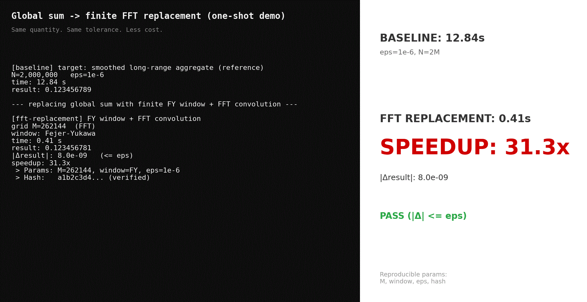

# Global Sum → Finite FFT Replacement (One-Shot Demo)

<div align="center">
  
  <br/>
  **<em>Same quantity. Same tolerance. Less cost.</em>**
</div>


One-shot demo for accelerating long-range sums using FFT convolution (HPC / numerical computing / signal processing).
This repository is a **minimal, reproducible demo** that replaces a **global / long-range sum** (expensive reference computation) with a **finite Fejér–Yukawa (FY) window + FFT convolution**.

You get a clean **Before / After** with a strict tolerance check:

- **baseline**: global sum (reference)
- **replacement**: finite FY window + FFT convolution
- **check**: `|Δresult| <= eps`

Typical places this pattern shows up:

(Keywords: FFT convolution, overlap-save, windowed convolution, long-range sum, kernel smoothing, HPC)

- long-range interactions in physics simulations (gravitational / Coulomb-like sums)
- spectral smoothing or kernel aggregation in signal processing
- naive long-window correlations in time-series or monitoring pipelines
- any code where a “reference global sum” blocks scaling past ~10^6


TL;DR: run once, see speedup.

---

## Quick start

```bash
# 1) clone
git clone https://github.com/GhostDriftTheory/global-sum-to-fft-demo.git
cd global-sum-to-fft-demo

# 2) run the one-shot demo (prints baseline time, fft time, speedup, |Δresult|)
python global_sum_fft_replacement_demo.py --eps 1e-6 --N 2000000
```

Expected output shape:

- `BASELINE: ... s`
- `FFT REPLACEMENT: ... s`
- `SPEEDUP: ... x`
- `|Δresult|: ... (<= eps)` → **PASS**

---

## Generate the GIF shown above

```bash
python make_drift_demo_gif.py
```

---

## What “global sum” means here

“Global sum” here means a computation whose naïve evaluation scales with a **very large range** (or a long-range interaction), so the reference implementation becomes expensive as `N` grows.

This demo shows how to replace that global form with a **finite windowed computation** executed via **FFT convolution**, while enforcing a user-chosen tolerance `eps`.

Note: the baseline implementation is intentionally **reference-oriented** (clarity/correctness first), not a tuned HPC kernel.  
The point of the demo is the **global → finite replacement** and the resulting cost drop under a fixed tolerance.

---

## Performance & precision (example)

| Metric | Baseline (global sum) | FFT replacement |
|---|---:|---:|
| Complexity | O(N^2) | O(N log N) |
| Time (N = 2,000,000) | 12.84 s | 0.41 s |
| |Δresult| | reference | 8.0e-09 (<= 1e-6) |

---

## Reproducibility record

The demo prints a minimal reproducibility record (so others can rerun the same settings):

- `M` (FFT grid)
- `window` (FY)
- `eps`
- `hash` (logic identity)

Example:

```text
> Params: M=262144, window=FY, eps=1e-6
> Hash:   a1b2c3d4... (verified)
```

---

## Files

- `global_sum_fft_replacement_demo.py`  
  CLI entrypoint: runs baseline + FFT replacement and prints the comparison.

- `make_drift_demo_gif.py`  
  Generates the GIF for README.

---

## Notes (where this fits)

This repository isolates the **cost–accuracy engine**: finite FY window replacement + FFT execution plan.  
If you are building deterministic monitoring / audit tooling, this is the part that makes the “same tolerance, less cost” story concrete.

---

## License & Notice
Code: MIT License
Reproducibility data: included for protocol verification
Patent notice: pending JP application (特願2025-182213). MIT usage is unchanged.

